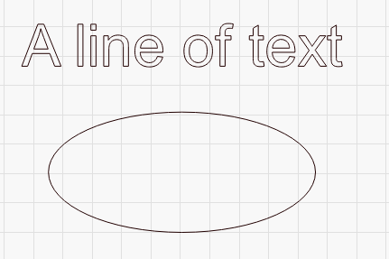
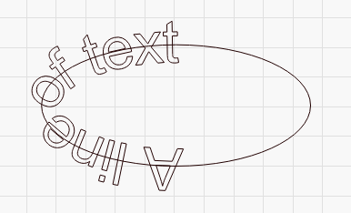

[Return to main page](README.md)

----

# Apply Path to Text

A video tutorial for this feature can be found on our YouTube channel, here:  [Path to Text tutorial](<https://www.youtube.com/watch?v=IDRx4-D1DWk>)

To use this feature, create a single line of text, and a path or shape to wrap the text around, like this:

Select both the text and the path, then go to Tools > Apply Path to Text, and the text will attach itself to the path, like this:

You can change the horizontal and vertical alignment of the text (left/right/center), as well as edit the path itself, to position the text the way you like.  We recommend creating specific shapes for the text paths, and setting them not to output so they are not part of the design that gets sent to the laser.