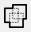
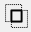

[Return to main page](README.md)

----

# Boolean Operations

### Weld, Union, Subtract and Intersection for vectors

On the left hand side of the tool bar there are 4 icons that allow you to combine (Weld) vector shapes, add (Union A+B) vector shapes, subtract (Boolean Subtract A-B) vector shapes and Intersect (Boolean A and B) vector shapes. Each icon is a visual representation of what it will do to the selected shapes.

## Weld

Clicking on the Weld icon will join all the selected shapes into a single entity that is the outline of all the selected shapes.

## Boolean Union

Union is similar to weld, but works with 2 selected objects only. However these selected objects can actually be grouped items, not just a single vector shape.

## Boolean Subtract 

Boolean subtract will remove the area that the second selected shape overlaps the first shape by. The order in which you select shapes will determine the outcome. This tool also works with grouped items.

## Boolean Intersection

This will create a shape from 2 selected shapes that has an outline defined by only the areas in which the shapes overlap. This tool also works with grouped items.

## Quick Video Walkthrough of the Boolean Operations

Click for a [Boolean demonstration video](https://www.youtube.com/watch?v=51cXqmNHgeI)

The above video describes in more detail how the various Boolean operations differ, and why welding text to a circle should be done with a Boolean Union instead.