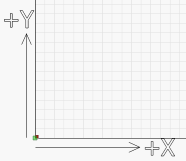
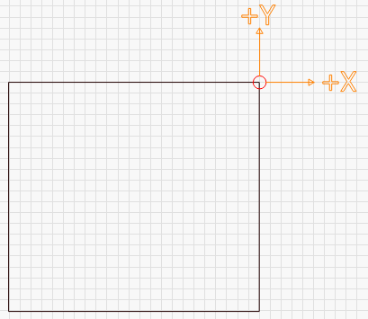

[Return to main page](README.md)

----

# Common Grbl setups

If you have a GCode-based system, like a Shapeoko, Eleksmaker,  X-Carve, or Acro system, you might need to make some simple changes to get the most from LightBurn.

#### Grbl Flavors

Grbl firmware was originally designed for CNC machines and 3D printers, with laser support added more recently.  It is highly configurable, and this is both a blessing and a curse. The "standard" way a CNC machine is configured is somewhat different than the way laser machines often are.  Luckily this is easy to change, and easy to switch from one to the other.

The latest versions of Grbl (1.1f and onward) support a feature called variable power mode for lasers. This allows the laser power to be adjusted up and down as the machine speeds up and slows down, making for very consistent cutting and marking. Older versions of Grbl do not have this feature, and simply run the laser at a constant power output for the duration of a cut.  Since the machine needs to slow down to take sharp corners, this means corners get over-burnt, while long straight lines end up lighter.

This also has the benefit that when the laser comes to a complete stop, the beam turns off (zero speed equals zero power), meaning that pausing a job automatically turns off the laser. This is not always true with other versions of Grbl.

If you aren't already running Grbl 1.1f on your controller, we highly recommend it for laser use.  If this isn't an option, that's ok, but your results won't be as good, and pausing the laser runs the risk of leaving the beam on and ruining the job.

## Shapeoko

Shapeoko machines typically use Grbl 1.1f, but are configured for negative workspace coordinates, which LightBurn doesn't support.  This is an easy thing to work around though, using a workspace offset.

We'll use a Shapeoko XXL as our example setup.  This machine has an 812mm x 812mm working area, and the origin is set to the rear-right, with negative numbers going down and to the left (onto our workspace). We're going to leave the direction alone, but change the origin position by using this command in the LightBurn Console window:

​	G10 L2 P1 X-812 Y-812

That command says "set an offset" (G10 L2) in the first coordinate system (P1) of X -812 and Y -812.  (If your machine is a different size, use your width and height values in mm instead of the 812's shown here, and remember the minus signs - those are important)

This shifts the origin point of the machine left and forward by the size of the workspace. Then you tell LightBurn that the origin is at the front-left of the machine, instead of the rear-right, and you're done.

When you want to go back to using your machine for CNC use, clear the offset with:

​	G10 L2 P1 X0 Y0

It is simple to set these up as macro buttons in the LightBurn console window.  Enter the first command into a macro and call it "Use Laser", and enter the second command into a different macro and call it "Use CNC".  When you want to use your laser, click the "User Laser" macro button, and when you're done and want to switch back to CNC, click the "Use CNC" button.

## X-Carve

X-Carve machines usually run an older flavor of Grbl (1.0c) which does not support the variable power (M4) command, meaning you'll need to use the Grbl-M3 device in LightBurn.

## Other machines

If you aren't sure how to configure your machine, there are some simple steps to take that can help. First, figure out which firmware you're running. In LightBurn, when you first connect to the machine, the console window will usually show a 'hello' message from the controller.  For Smoothieware boards it's just "Smoothie".  For Grbl, it will be "Grbl 1.1f [$ for help]" or similar - this tells you it's Grbl, and which version. Machines using Grbl 1.1f or later will support the M4 variable power command, and just use the "Grbl" driver in LightBurn.  Grbl 1.1e or older (Grbl 1.0, Grbl 0.9, etc) must use the Grbl-M3 device in LightBurn.

With the driver identified, it's time to find the machine origin. First, home the machine by pressing the Home button () on the Move window.

In the console window, type

​	G0 X0 Y0

then hit enter.  Your machine will head toward its origin position. This isn't always the same as where the home position is. Usually the home position is in one of the corners. Most often it will be the rear-right, or front-left of the machine. In some cases, it might be the center of the work area. If your machine does this, skip ahead to '**Center Origin Machines**' below.

After it stops moving, type

​	G0 X10 Y10

then hit enter. If your machine moves 10mm into the work area on both axis that's good - it means your machine uses positive workspace coordinates. You simply set the origin in LightBurn to match the machine origin discovered above.  If your machine bumped the rails, it uses negative coordinates.

##### Negative Coordinate Machines

If your machine uses negative coordinate space, we need to offset the origin.

LightBurn wants positive workspace numbers, like this:

This image shows the origin at the front-left, with positive X values moving to the right, and positive Y values heading to the rear of the machine.

A negative workspace system looks like this:

In this image, the origin is at the rear-right of the machine.  The X and Y directions are the same as before, but now, to move into the work area, you would need to use negative numbers.  Instead, we're going to set up a work offset.

You'll need to know the total distance your machine can travel in both axis.  For a Shapeoko XXL, for example, it's 812mm in X and Y. For a 500x500 X-Carve, it's 250mm in X and Y.

Enter the following command:

​	G10 L2 P1 X-250 Y-250

in the console, and hit enter. Note that the '250' above should be replaced with the total travel width and height of your machine.  If your machine had a 600mm width and 400mm height, you would use:

​	G10 L2 P1 X-600 Y-400

This command offsets the origin by the given amounts. If the origin used to be in the rear-right of the machine, and you offset it in the negative direction by the width and height of the work area, you've moved the origin to the front-left.

##### Center Origin Machines

Some systems have their origin in the center of the workspace. After homing your machine, enter this command in the console and hit enter:

​	G0 X0 Y0

That command says "rapid move to coordinate 0,0"

If your machine does this, you still need to move the origin just like in the "Negative Coordinate Machines" above, but only by half the size of your workspace. Follow the directions for a negative coordinate space machine, but divide your workspace numbers in half before issuing the GCode offset command.

