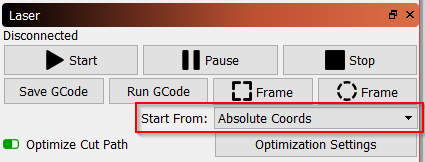
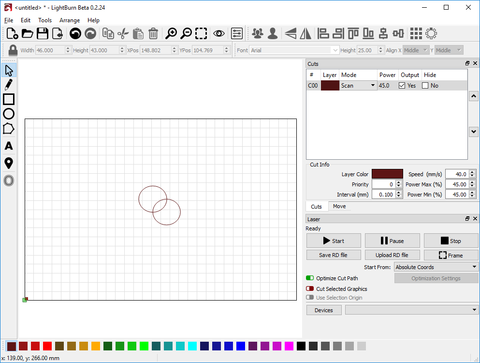
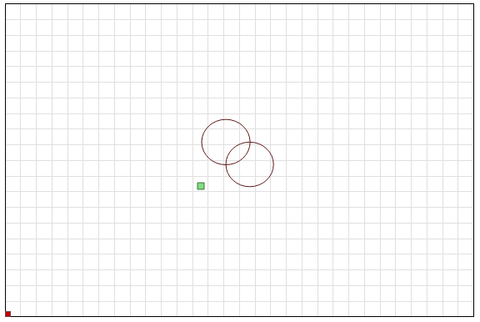
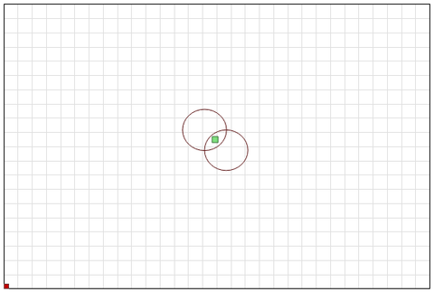
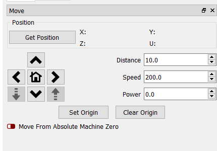

[Return to main page](README.md)

----

# Coordinates and Job Origin

There are a couple different ways to tell LightBurn how to cut the project within the work area of your machine.  You choose them in the "Start From" box on the Laser tab:

## Absolute Coordinates

**Absolute Coordinates** is the simplest - The page grid you see in the main editing window represents your machine's work area.  Anything you place in that area will be cut in the corresponding place on your machine.  Users with small lasers like the K40 will likely find this the simplest and most intuitive option.

In the image below, the two circles placed in the middle of the work area will be cut in the middle of the machine work area.  The green square in the lower-left of the image represents the Job Origin, and the red square in the same place shows the Machine Origin.  In "Absolute Coordinates" these are always in the same place.

## Current Position

**Current Position** is probably the next easiest to use.  Your job cuts relative to the current position of the laser head when you hit the Start button.  You use the "Job Origin" value in the Settings window to tell LightBurn how to position the job relative to the laser.

In this image, we're starting from the Current Position, with the Job Origin set to the lower left:

Notice that the green "Job Origin" indicator has moved.  This represents the position of the laser when you start the job, so the laser is going to move slightly up and to the right from wherever it is, cut the two circles, and go back to where it started.

Imagine that you wanted to cut this amazing two-circle pattern onto a beverage coaster or a phone case.  Lining it up like this is not easy.  If you change the Job Origin setting to "Center", you get this instead:

Now the job is going to be cut centered around the current position of the laser head.  If you position the laser directly over the center of the item you want to cut, the resulting image will be centered on the item.

Using Current Position and Job Origin together lets you line up a cut on a piece of material with ease, once you understand how it works.

## User Origin

**User Origin** works almost exactly the same as Current Position, except that the starting location is "programmable".  Some lasers have an "Origin" button on them (like Ruida controllers).  GCode based systems use the "Set Origin" button in LightBurn to do the same thing.  You jog your laser to the position you want your job to start from, hit the "Set Origin" button, and then you're free to move the laser around again.  If you specify "User Origin" as the "Start From" value, the laser will move back to that programmed location and start the cut from there.

<a name="FinishPosition"/>

## Finish Position

LightBurn gives you the control of where you want the head of the laser to return to after a job is finished. By default it will return to 0,0 however this is not the optimal location for some machines. 

To change your finish position, go to the Move tool window and use the arrows to reposition your laser head to where you would like it to return to on job finish. Then click the **Set Finish Position** button. Your machine will now remember that spot for future jobs. This can be reset at any time by repeating these steps for a new location.

