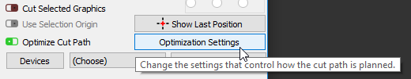
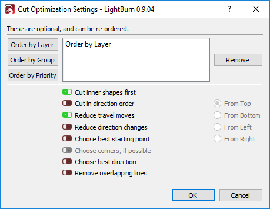

[Return to main page](README.md)

----

# Cut Optimization Settings - Cut Planner

[Video Tutorial on YouTube - Click here](https://www.youtube.com/watch?v=w1hG1wv8tS4)

The cut planner gives you a great deal of control over the ordering of your cuts - you can let LightBurn try to choose the best path for you, order it piece by piece yourself, or somewhere in between.  The new options are powerful, and we'll have a video coming soon to demonstrate them.  If you have "Order by Layer" as the only entry in the list at the top (the default), it will behave the way you're used to. After selecting your choices in the cut planner, use the Preview (Alt-P) to see how your choices have impacted things by using the slider at the bottom of the window.

Access these settings by pressing the Optimization Settings button shown here:

The settings are displayed in this dialog (and the defaults are shown here):

## Order By

You can select what the initial order parameter will be. You have a choice of Layer, Groups or Priority. As well you can use a combination of these three choices in any order you wish.

#### Order By Layer

If you choose Order By Layer, the cut planner will apply all optimizations to the first layer, then the second layer, and so on.

 #### Order By Groups

If you choose Order By groups the cut planner will apply all optimizations to a Grouped object, then the next Grouped object, and  so on.

#### Order By Priority 

If you choose Order By Priority, the cut planner will  apply all optimizations to the objects with the highest priority (Assigned in the Shape Properties Window) first, then the next lowest and so on.

## Optimizations

#### Cut Inner Shapes First

As the name implies, if there is an object within another object, and both are being cut, it will cut out the inside object before the outside one.

#### Cut In Direction Order
This will try to cut the shapes in your project in the specified direction - top to bottom, left to right, etc.

#### Reduce Travel Moves

This will have the cut planner try to order the cuts in a way that it will choose objects beside each other to try and reduce non cutting travel moves.

#### Reduce Direction Changes

The cut planner will try to choose cuts that allow it to keep moving in the same direction.

#### Choose Best Starting Point

Allows the system to start a cut at any point within a shape, not just the first point. Works best when "reduce travel moves" is also enabled.

#### Choose Corners, If Possible

The cut planner will attempt to start a cut at a sharp corner to minimize burning or staining on the surface of an item.

#### Choose Best Direction

The cut planner will attempt to choose the best direction to cut in.

#### Remove Overlapping Lines

The cut planner will remove lines that overlap each other that would cause the laser to cut in the same place twice.
