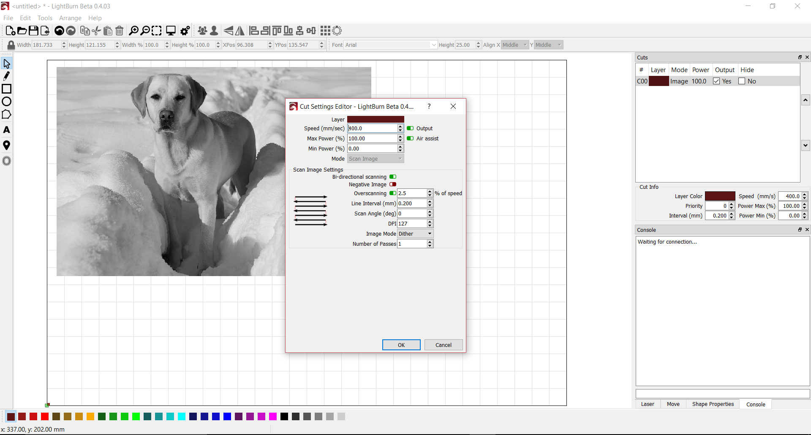
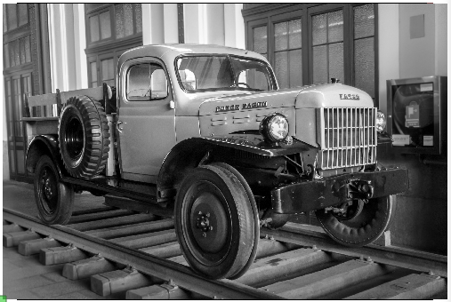
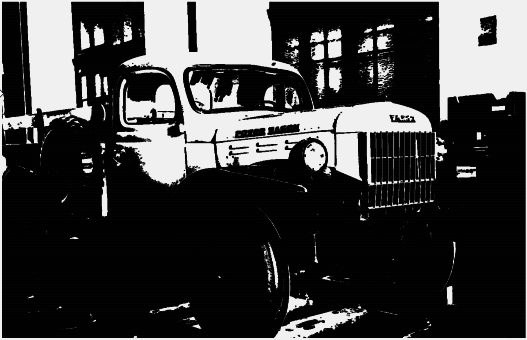
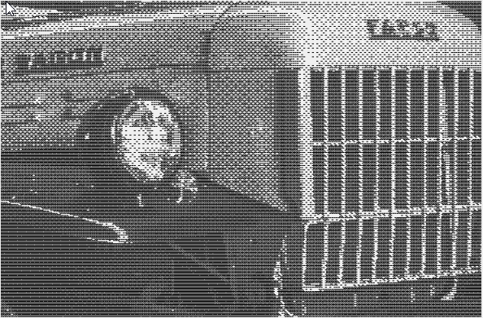
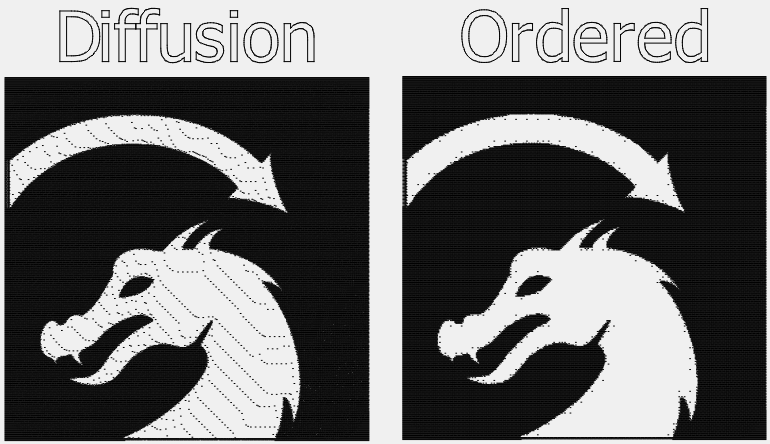

[Return to main page](README.md)

# Engraving Raster Images

[Supported Image Files](#supported)

[Engraving Configuration](#configuration)

-----

LightBurn has the ability to engrave raster images (photo engrave) without additional effort.

## Supported image files

* bmp (Bitmap)
* jpg and jpeg (Joint Photographic Exports Group)
* png (Portable Network Graphics) 
* gif (Graphics Interchange Format)
* tga (Truevision)

## Engraving Configuration

Double click on the cut layer in the Cuts tool window to launch the Cut Settings Editor window.

### Speed

See [Speed](/Operations.md#speed) under Operations

### Max Power

The maximum laser power for pure black. Setting this to a lower value will decrease the power of the laser when engraving absolute black. 

### Min Power

The minimum power of the laser for pure white. Increasing this value beyond your lasers firing threshold will allow the laser to fire for absolute white.

***TODO: Reword the next section***

*A note on Min/Max power:* This scale affects the entire range from white to black. If your image does not have absolute black or absolute white then it will not ever fire at the min/max settings. 

### Mode

Disabled for raster images

### Bi-Directional Scanning

See [Bi-Directional Scanning](/Operations.md#bidirectional) under Operations

### Negative Image

This will invert your image during engraving. Light becomes dark, dark becomes light. This is useful for engraving slate or glass, where burned areas become lighter.

### Overscanning

See [Overscanning](/Operations.md#overscanning) under Operations

### Line Interval

See [Line Interval](/Operations.md#lineinterval) under Operations

### Scan Angle

See [Scan Angle](/Operations.md#scanangle) under Operations

### DPI

Controls the pixel density of the output - this is simply another way of representing line interval that is more intuitive for some.  DPI (dots per inch) is just 25.4 / interval.

### Image Mode

Changing the image mode will change the algorithm used to prepare the image for engraving.

- **Threshold**: a simple on / off switch if the image is dark / bright at a given location. This should only be used for images that are two-color black/white to begin with, like an image you dithered outside of LightBurn.  Don't use this mode for grayscale or color images.
- **Ordered**: Also called ordered dithering, this is a step above threshold for grayscale images, and uses densely packed on/off dots to approximate shading, using an ordered/regular grid pattern. This is ok for general use, but works best for images with large areas of solid fill, where diffusion dithering can cause unwanted artifacts (see below).
- **Dithered**: Also called error diffusion dithering, this is the best choice for smoothly shaded images, like photos. This also approximates shading with simple dots, but does so without evident patterning, and tends to produce more subtle shading.

Here's how they look.  The original image (Madrid truck):

Threshold:

Ordered:

Dithered:

#### Limitations with dithering

Dithering is attempting to use 2 colors (black and white) to approximate continuous shading, and it has its limits. Diffusion dithering works by remembering how "off" a given pixel was, and smearing (diffusing) that difference around over neighboring pixels. When those neighbors are computed, that error amount is factored in. If you have an image with large areas of solid black or white, there's nowhere for this error amount to get absorbed (black and white are always exact), so it keeps pushing it further and further, and you sometimes end up with strange lines or tendrils in your picture. Ordered dithering does not have this issue, so it works better for "solid filled" images, like cartoons or logos.

The LightBurn icon is shown below using in both diffusion and ordered dithering.

### Number of Passes

How many times to repeat the entire engraving process.

