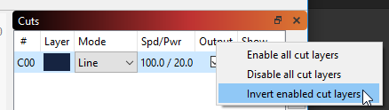

[Return to main page](README.md)

----

# Layers

LightBurn allows you to set up multiple types of cut with different settings in a single job. The different parts of the job are assigned to different layers in LightBurn by color, and the color palette is shown at the bottom of the LightBurn workspace by default:

### Assigning layers manually

To use the layers palette, select an item in your workspace, like a shape or image, and then click a color from the palette at the bottom of the screen. This color will now be assigned to a new layer that you will see in the Cuts toolbox, normally shown on the upper right of the window. Any item you assign to the same color will be placed in the same layer, and all the settings for that layer will apply to it.

As seen in the image below, each shape and image is color coded to a different layer and each layer is capable of having a different set of instructions for your laser. 

### Assigning layers automatically

When importing artwork from other software, LightBurn will look at your assigned colors and attempt to match them to a color in the LightBurn layer palette. If an exact match is available it will assign it. Otherwise it will assign unmatched colors to the closest available color in the palette.

### Layer options

You can adjust the order of operations across layers by selecting an entry in the Cuts window and then clicking the up/down arrows to the right of the window.  By default, LightBurn will process your layers in the order they appear in this window. (You can change this with the [Optimization Settings](CutPlanner.md) button)

This is a powerful tool to control which parts of your job are completed first and which are last such as engrave and then cut.

As a drawing gets more complex it can become difficult to determine what is on a given layer. If you right click the layer in the Cuts toolbox, the items in that layer will flash on the screen.

Also layers can be set to output or not by checking the Output checkbox. Turning this off will prevent the layer from being sent to your laser but will be recognized for current position or user job origination settings. Using this would allow you to place a representation of your work piece as a guide for alignment and setup while not actually burning. Layers set not to output will dim in the edit window.

You can also hide a layer, which will turn the visibility on the screen on and off and can be helpful when working with complex drawings.

You can quickly enable, disable, or toggle the Output or Show state of your layers by right-clicking the column header in the Cuts toolbox:

### Layer memory

Layer palette colors will retain a memory of the last setting used. If your last job used black for trace, red for scan and blue for cut with specific power and speed settings, LightBurn will remember that the next time you assign those colors to a layer. 