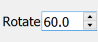
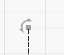

[Return to main page](README.md)

----

# Manipulating Drawings

#### Scaling and Resizing

##### Understanding Scale vs Size

The tool bar and the drag handles will alter the scale of an object. The Shape Properties will alter the size of the object. This is an important concept that is not always easy to understand.

Take the following example

A diamond best expresses this concept as the actual size of the image in the Shape Properties differs from the width and height shown in the toolbar at the top. In this case, the diamond measures 50x50 however the measurement of the overall footprint of the diamond is actually just over 70x70 if you measure from corner to corner. If you scale this shape using the toolbar or the drag handles, it will appear to resize the diamond but in fact it's just squashing it or stretching it out to fill the dimensions you specify. The underlying diamond is still 50x50. 

This is especially important for corner radius. The only way to change the size of your drawing and maintain the proportionality of the corner radius is to change it in the Shape Properties. If you scale the image the corners will stretch or squash just like the rest of the shape to fit your set scale dimensions.

##### Scaling with Drag Handles

When you select a drawing a set of 8 drag handles will appear around the perimeter. Clicking and dragging with these handles will scale your drawing freehand. When doing this you can also note the width and height in the toolbar updating accordingly. 

##### Scaling with Toolbar

When you select a drawing, you can accurately scale using the width and height using the toolbar values.

##### Resizing with Shape Properties

Using the Shape Properties dialog will resize the shape (note this is different from scaling). Using this will maintain corner radius proportions.

-----------

#### Rotation

##### With Toolbar

You can rotate a drawing by selecting the drawing and providing an exact degree of rotation in the toolbar

##### With Rotation Handles

You can also rotate by grabbing the rotation drag handle and rotating freehand

-------------------

#### Corner Radius

##### Shape Properties

You can easily set a corner radius in the Shape Properties dialog box. This will set the radius relative to the width and height in Shape Properties. If you try to scale the image with the toolbar or drag handles, the corners will skew accordingly. However resizing with the Shape Properties width and height will maintain the radius as set.

---------------

#### Placement

##### Toolbar

You can quickly and accurately place your drawing to specific points in your working area including Page Center, Upper Left or Right, Lower Left or Right or Laser Position. After selecting your drawing click on the placement toolbar icon and select your location.

