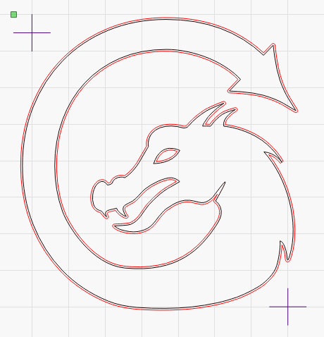
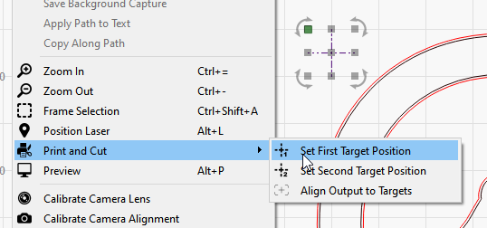
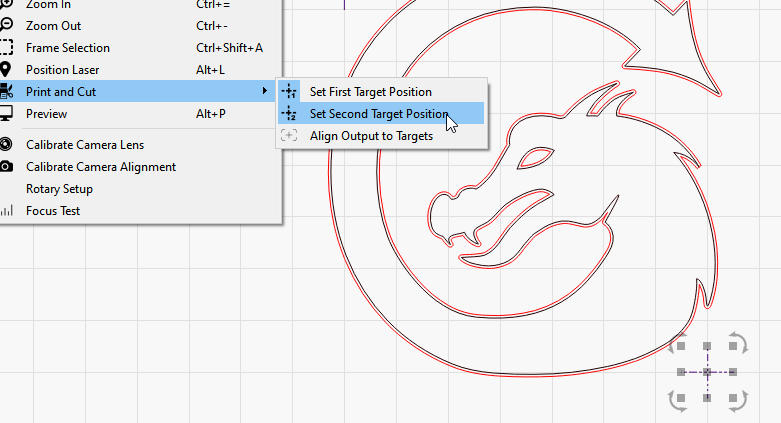
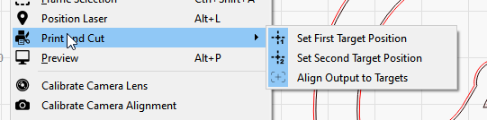
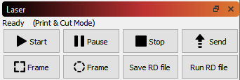
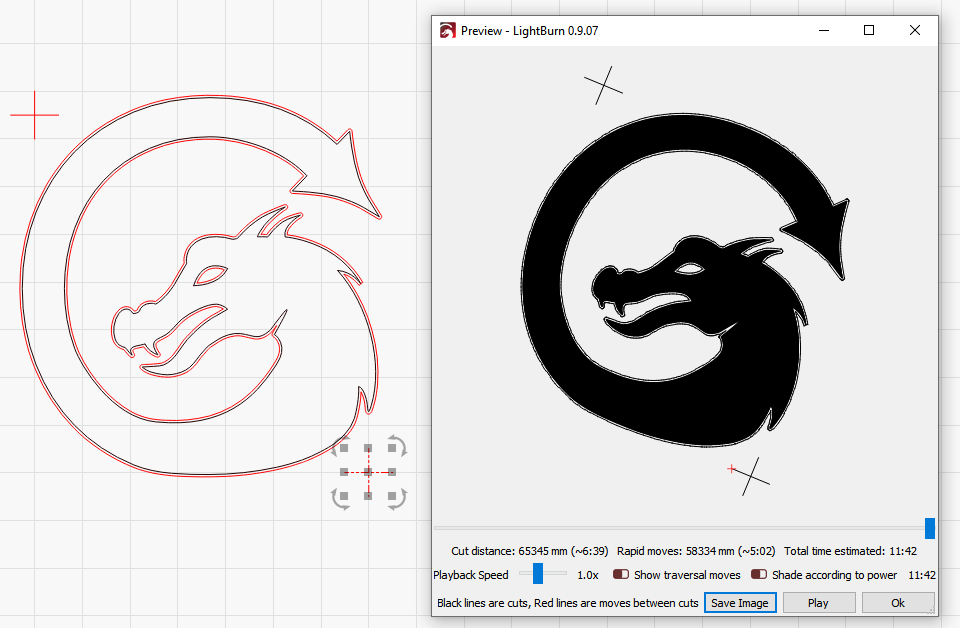
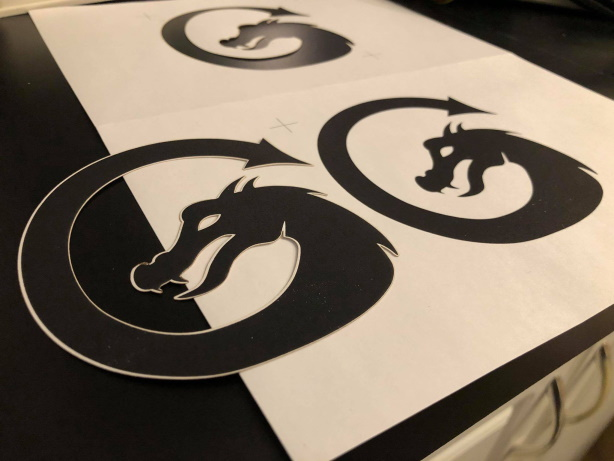

[Return to main page](README.md)

----

# Print and Cut with LightBurn

"Print and Cut" normally refers to the ability to print a design on a printer, then have it automatically cut it out with a blade or laser cutting machine by using registration marks on the print to align the cut to it.

**Note:** In order for the output to be positioned correctly on your laser, you *must* use *Absolute Coords* as the positioning mode, otherwise the output will not match the position of the print.

As an example, take this design, printed on sticker paper:

	

I've imported the same design into LightBurn, with the cross-hair markers, and added an outline to the dragon using the offset tool:

The important part in this file is the two cross-hair marks - these are the target marks that you will use to align the cutting path with the printed sticker.  They don't have to be cross-hairs, but these are simplest to align with, as the *center* of the selected object is what is used for alignment when recording positions.

The red lines are set as cut vectors, with an appropriate power and speed, and the black lines can either be set not to output, or simply deleted.

After placing the printed version of the file in the laser, follow these steps to align the laser output with the print.

Using the red-dot pointer of your laser, jog the laser head to align with the center point of one of the two cross-hair marks.

In LightBurn, select the same cross-hair mark, then go to Tools > Print and Cut > Set First Target Location, like this:

 

Now, jog the laser to align the red dot pointer to the center of the second marker

In LightBurn, choose Tools > Print and Cut > Set Second Target Location:

You will notice that in the above image, the menu option for 'Set First Target Position' has the icon highlighted as well - this means that the First Target Position is set and active.

After setting both targets, the menu will automatically enable the 'Align Output to Targets' option for you, like this:

You will also see the "(Print & Cut mode)" message in the status window, like this:

If you preview at this point, the orientation of the preview should match that of the print on your laser:

In the above image, you can see the preview image is rotated slightly counter-clockwise.

**Note:** In order for the output to be positioned correctly on your laser, you *must* use *Absolute Coords* as the positioning mode, otherwise the output will not match the position of the print.  The accuracy of the result will be affected by the accuracy of your red-dot pointer, so using one that is either a cross-hair beam pointer or a red-dot marker that is in the same beam path as your laser is ideal.

After running the job on the laser, this is the result:

