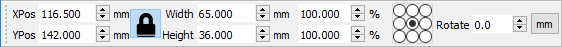
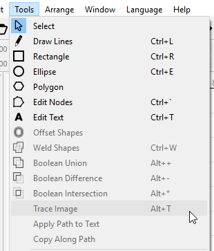

[Return to main page](README.md)

----

## Toolbars and Tool Windows

The workspace has may toolbar and tool windows to make working with files fairly easy and intuitive. Right clicking on the top bar of the app will allow you to toggle toolbars on or off, as will using the 'Window' menu in the main menu bar.

### Manipulating Tool Windows and Tabs

You can undock a tool window and make it floating by dragging it away from the other tool windows. You can also click the min/max button in the upper right of the tool window to undock it.

You can dock the tool window by itself by dragging it to the right or left of the screen and dropping it in an area that highlights blue when you hover over it.

You can dock the tool window as a tab by dropping it on top of another docked tool window.

You can close a tool window by clicking the X in the upper right of the tool window or by turning it off in the toolbar context menu as seen in the [Tools and Toolbars](#toolbars) section above.

You can reorder tabs by clicking on the tab and dragging it left or right in the tab strip.

[Return to Top](#Top)

#### Tool Windows provide a grouped set of tools for various operations. 

* [Cuts](#cuts)
* [File List](#filelist)
* [Laser](#laser)
* [Move](#move)
* [Shape Properties](#shapeproperties)
* [Console](#console)  

#### Toolbars are similar to Tool Windows, but are a grouped set of icons for various types of operations.

* [Tools](#Tools)
* [Arrange](#Arrange)
* [Numeric Edits](#Numeric)
* [Text Edits](#Text)

[Return to Top](#Top)

### Cuts

The Cuts tool window is where you will configure most of your job. It contains layers of cut operations that can be reordered and have various machine operations configured.  Details of the possible Modes and settings are covered in the [Operations](Operations.md) section.

* A right click on a cut layer will cause the items that are on that cut layer to flash in the workspace. 
* Double clicking a cut layer will launch the full settings editor for that layer
* You can quickly select the Mode or set the layer Output and Hide options directly from the tool window
* You can quickly set the basic operation parameters in the *Cut Info* section
* Clicking the up or down arrows on the right side of the tool window will move the selected layer up or down in priority (as will editing the Priority value below)
* Clicking the small left / right arrows to the right side of the tool window will store the selected cut in the scratchpad, or apply the scratchpad setting to the selected cut. This is a handy way to store and recall a default setting if you have your own preferred settings you like to start from.
* Right-Clicking on the Output or Show text above the cut list will let you quickly toggle, enable, or disable that setting for all layers.

[Return to Top](#Top)

### File List

This is currently for Ruida controllers, but will be implemented for Smoothie controllers as well. This window lets you manage the files hosted on your controller, if it supports this.

Hit the Refresh button to query your controller for the list of hosted files. You can select a file and press Start to cut it, Delete to remove it from the controller, or Download to save it locally. Pressing Upload will let you choose a local cut file to send to the controller (this is not the same as the current job, which you can upload with the "Send" button in the Laser window - see the [Machine Instructions](MachineInstructions.md) page for more details). Be careful with the Delete All Files button.

[Return to Top](#Top)

### Laser

The Laser tool window is used to interact with the connected device. 

This tool window provides most of the functions for interacting directly with your laser. The commands are covered in detail elsewhere in the documentation. You can also enable the rotary here, as well as change the job origin.

For a detailed explanation of the *Start From* options, see [Coordinates and Origin](CoordinatesOrigin.md)

[Return to Top](#Top)

### Move

The Move tool window is used primarily for Jog and Home functions

Here you can manually jog your laser head to different positions by selecting one of the arrow buttons around the home button. This will move your head by the set distance, speed and power entered in the toolbox. 

You can also set or clear a custom origin or get the current reported position.

[Return to Top](#Top)

### Shape Properties

Shape properties is used for setting properties specific to a selected shape, or shapes.  Some properties appear on all shapes, like Cut Order Priority or Power Scale, and some are specific to certain types of shape, like Radius on circles, or Corner Radius on rectangles.

Cut Order Priority allows you to tell the cut planner to cut certain shapes before or after other shapes, when the Cut by Priority option is set in the Cut Planner [optimization settings](CutPlanner.md).

Power Scale lets you tell LightBurn to use a percentage of the selected power for a given shape. This allows you to set different shapes within the same layer to a higher or lower laser power percentage without creating a new layer. This is especially useful for creating test patterns and is covered in detail in the Video [LightBurn progress demo #9 - Power Scaling](https://www.youtube.com/watch?v=ZiUAOv4tAGY) You can also choose what direction the shape should be cut in. This will be used by the cut planner to determine the cut direction.

[Return to Top](#Top)

### Console

On non-Ruida machines, a console toolbox is available for directly inputting commands. You can type a command in the text box and the console will output the results. Examples would be manual G-Code commands or retrieving configuration details from your connected device. 

Note, this is not available on non-gcode devices, like Ruida and Trocen controllers.

[Return to Top](#Top)

## Main Toolbar

This is primarily for changing the size, position, and orientation of the current selection.

The Lock icon is used to enable or disable aspect ratio locking. With the lock enabled, changing the width of an object will also adjust the height, and vice versa.  For example, if your object was 100mm x 50mm and you changed the width to 80mm, LightBurn would automatically change the height to 40mm, maintaining the aspect ratio of the object.  Turning off the lock allows the width and height to be manipulated independently.

LightBurn's X & Y position, width, height, scale, and interval entry boxes now support expressions and units. What does this mean for you?

If you type 1/2in, and you're in mm mode, it'll turn into 12.7.  If you're in inch mode and type 1/2in, it'll become 0.5.  You can use ft, cm, in, or mm, along with normal math symbols and parenthesis (*/-+).  You can combine them, so entering (1/2in + 3mm) * 2.5 + 1ft is valid.  You can type 1/300in in the interval box to have it convert "300 lines per inch" into an interval for you. This should make working in mixed units easier.

The 9-point control selects the anchor point that objects resize from.  For example, if you select the upper-right dot, the upper right of the selection is anchored when resizing.

The small button on the far left of the toolbar allows you to quickly toggle between mm and inch measurements in the UI.  When using this toggle, only distance measures are changed - speeds will always be viewed in mm.

[Return to Top](#Top)

## Tools Toolbar

On the left of the workspace in the default configuration, there is a tool bar with many of the commonly used tools. These are also duplicated in the tool menu at the top of the workspace, and this menu also displays the hotkeys to quickly access them.

The tools are as follows:

### Select
Click on the "Select" icon to select objects in the workspace, or to access menus and toolbars. You can also quickly get back to Select mode by pressing Esc.
### Draw Lines
Click on the "Draw Lines" icon to draw straight lines in the workspace, or press Ctrl-L (or Command-L on Mac).
### Rectangle Tool
Click on the "Rectangle" icon to draw rectangles in the workspace, or press Ctrl-R (or Command-R on Mac).
### Ellipse Tool
Click on the "Ellipse" icon to draw ellipses in the workspace.

### Polygon Tool

Click on the "Polygon" icon to draw regular polygons, like hexagons, triangles, pentagons, and so on. The number of sides can be edited in the Shape Properties window.

### Edit Nodes
Click on the "Edit Nodes" icon to edit nodes of objects in the workspace, or press Ctrl-`.
### Edit Text
Click on the "Edit Text" icon to create or edit text in the workspace, or press Ctrl-T.
### Position Laser
Click on the "Position Laser" icon to allow clicking on the workspace to move the laser head to that location.
### Offset Vectors
Click on the "Offset Vectors" icon to createnew vectors that are an offset of the original vector selected.

### Weld, Union, Difference, and Intersect Vectors

These four operations are covered in the [Boolean Operations](Boolean.md) page.

### Grid Array

Create an array of copies of the current selection, arranged in a grid with editable spacing and other options.

### Radial Array

Create an array of copies of the current selection, arranged in a circle, with editable spacing and other options.

### Edit Start Point

Edit the point and direction that LightBurn will use to start cutting the selected shape, or shapes.

[Return to Top](#Top)

## Arrange Toolbar

[Return to Top](#Top)

## Numeric Edits Toolbar

[Return to Top](#Top)

## Text Options Toolbar

You can select the font, size, and also Bold or Italic options here, as well at the Variable Text mode to use, if any.  More information about Variable Text can be found [here](VariableText.md).

[Return to Top](#Top)

