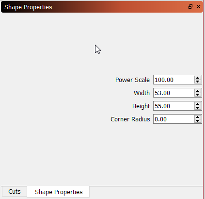
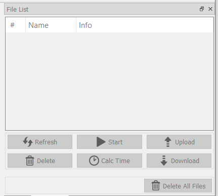

[Return to main page](README.md)

## Toolbars and Tool Windows

The workspace has may toolbar and tool windows to make working with files fairly easy and intuitive. Right clicking on the top bar of the app will allow you to toggle toolbars on or off.

The workspace by default has the following layout of the toolbar and tool windows.

## Laser Tool Window

## Shape Properties Tool Window

## Move Tool Window

## Console Tool Window

## File List

## Cuts

## Main Toolbar

## Tools Toolbar

On the left of the workspace in the default configuration, there is a tool bar with many of the commonly used tools. These are also duplicated in the tool menu at the top of the workspace. The tools are as follows:

### Select
Click on the "Select" icon to select objects in the workspace, or to access menus and toolbars.
### Draw Lines
Click on the "Draw Lines" icon to draw straight lines in the workspace.
### Rectangle Tool
Click on the "Rectangle" icon todraw rectangles in the workspace.
### Ellipse Tool
Click on the "Ellipse" icon to draw ellipses in the workspace.
### Edit Nodes
Click on the "Edit Nodes" icon to edit nodes of objects in the workspace.
### Edit Text
Click on the "Edit Text" icon to create or edit text in the workspace.
### Position Laser
Click on the "Position Laser" icon to allow clicking on the workspace to move the laser head to that location.
### Offset Vectors
Click on the "Offset Vectors" icon to createnew vectors that are an offset of the original vector selected.

## Arrange Toolbar

## Cuts Pallete Tool Window

## Numeric Edits Toolbar

## Text Options Toolbar

