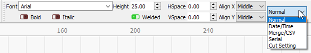

[Return to main page](README.md)

------

### Variable Text in LightBurn

Variable text is a feature that allows you to use special codes in your text entries that will be substituted for something else when you send the data to the laser (or the preview).  Variable text can be used for:

- Date or time stamps
- Serial numbers
- Displaying cut settings
- Merging a CSV file into your designs

In all of these cases, the text in LightBurn is set to one of the dynamic text modes, and the text entered is used to tell LightBurn what you want it to display.  You select the text mode like this:

With the mode selected, you enter one of the special codes for that mode, and when you preview, save, or send the file to the laser, LightBurn will replace the text with the desired output.

The different formatting codes are listed here: [Variable Text Formats](VariableTextFormats.md)

#### Variable Text Manager

If using serial numbers or a CSV file, you have additional controls, available in the Variable Text window in LightBurn, shown below:

The values shown are:

<u>**Current**</u>: The current serial number, or row from the CSV file, that will be displayed.

<u>**Start**</u>: The first serial number you want to use, or the first row in the CSV file to be used.

<u>**End**</u>: The last serial number to use, or the last row in the CSV file to use.

<u>**Advance by**</u>: Imagine you are creating a series of numbered labels.  Rather than cutting each one separately, you would most likely want to do several at once on a page.  The "Advance by" value tells LightBurn how many entries to advance ahead when you click the Next or Previous buttons, or when it automatically advances to the next page for you.

There is a shape property on text objects called <u>**Variable Offset**</u> which controls is added to the current variable text index when evaluating the text object.  This allows you to have text objects on your design that display different serial numbers, or different rows from the CSV file.

If you created a design with 4 name tag labels on the page, you would set the Variable Offset value for each of the four labels to 0, 1, 2, and 3, and tell the Variable Text manager to advance by 4 with each run.

