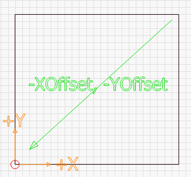

[Return to main page](README.md)

----

# Grblのセットアップ

もしShapeoko, Eleksmaker,  X-Carve, Acro system等のGCode-basedのシステムをお使いの場合、LightBurnの全てをご利用頂くためにいくつかの変更をして頂く必要があります。.

#### Grbl Flavors

GrblのファームウェアはCNCマシンや3Dプリンター用に開発されており、最近になってレーザーのサポートが始まりました。設定自体はしやすいのですが、ここに良い点と悪い点があります。"一般的"なCNCマシンは設定がレーザーマシンとは異なっているのです。ただこれは簡単に変更することが出来ます。

最新のGrblバージョン (1.1f 以降)はvariable power modeと呼ばれるレーザー用の機能をサポートしています。この機能はレーザー出力をマシンのスピードの変化に応じて調整することが出来るので、安定したカットやマーキングを行うことが出来ます。古いGrbl バージョンはこの機能がなく、単純にレーザーを一定量出力し続けていました。シャープな角を作るためにはマシンのスピードを落とす必要があるため、この設定では角は焦げてしまい、直線では必要な出力が出ない場合がありました。

他の利点としてレーザーが完全に止まった時にビームも止まるので(動いていない時は出力もされない)、ジョブを途中で止めると、自動的にレーザーも止めてくれます。これまでのGrblではこれが出来ませんでした。

もしまだGrbl 1.1f 以降のバージョンを使っていない場合レーザーのために利用することを推奨します。もし更新することが難しいのであればそれでも大丈夫なのですが、出来上がりは新しいバージョンよりも劣ったものになってしまいます。

## Shapeoko

Shapeokoのマシンは大抵Grbl 1.1fを利用しますが、LightBurnではサポートしないワークスペースの設定です。ただワークスペースのオフセットを利用することによって、簡単に変更することが出来ます。

Shapeoko XXLを例にしてセットアップを行います。このマシンの812mm x 812mmのワークスペースがあり、デフォルトでは原点は右後ろに設定されていて、マイナスの数字が左に向かう(ワークスペースの方向)に従って減っていきます。方向に関してはこのままの設定にしておきますが、原点の場所をLightBurnのコンソールで以下のコマンドを使って変更します。

​	G10 L2 P1 X-812 Y-812

これは最初のコーディネートシステム(P1) X -812とY -812に"オフセットをセットする" (G10 L2)  コマンドです (もしマシンサイズが違う場合は、それに沿ったサイズに変更してください。マイナスサインは重要なのでそちらを忘れないようにしてください)

これによって原点がマシンの左前に変わりました。その後LightBurnで原点をマシンの左前に設定すれば作業は完了です。

もしCNCで利用するために元の値に戻したい場合は、下記のコマンドでオフセットをクリアー出来ます。

​	G10 L2 P1 X0 Y0

LightBurnのコンソールでこれらをマクロ設定してしまえば作業が楽になります。1つ目のコマンドにUse LaserというマクロをLaser用に作り、もう一つUse CNCというコマンドをCNC用に作成すれば、レーザーを使う時はUse laserをクリック、CNCの時はUse CNCをクリックする事によって簡単に切り替えることが出来ます。

## X-Carve

2018年1月以前に販売されたX-CarveマシンはGrbl (1.0c)より古いバージョンで使用されていて、M4コマンドを利用することが出来ません。そのためこのマシンではGrbl-M3をLightBurnで使う必要があります。それ以降に販売された物はGrbl 1.1f以降を使用するので、次のコマンドをコンソールに入力することによって、LightBurnで利用することが出来ます。

$30=1000 
$32=1

この2つのコマンドによって、spindleの最大値をLightBurnの(\$30)とGrblのデフォルト値に (1000)設定し、laserモード(\$32)を可能にします。

## Other machines

もしあなたがお使いのマシンの設定方法が分からない場合は、簡単に方法で調べる方法があります。まずはファームウェアの確認です。初めてマシンに接続した際に、LightBurnからhelloメッセージを表示します。Smoothieware の場合は"Smoothie"と表示されます。Grblの場合、"Grbl 1.1f [$ for help]" のような形で表示され、Grblとそのバージョンが分かります。Grbl 1.1f かそれ以降のバージョンを使用するマシンはM4 variable powerコマンドを利用出来るので通常の"Grbl"ドライバーをご利用ください。Grbl 1.1e かそれよりも古いものは、(Grbl 1.0, Grbl 0.9, etc) Grbl-M3デバイスをご利用頂く必要があります。

ドライバー判明後は、マシンの原点を調べます。まずホームボタン()を押して、マシンをホームまで動かします。

コンソールでは下記を入力します

​	G0 X0 Y0

入力後マシンはホームポジションに移動します。ホームポジションはマシンによって異なります。通常はコーナーの一つがホームポジションに設定されています。大抵の場合、右後ろか左前が多いです。たまにワークスペースの真ん中に設定されている場合があります。その場合、この段落はスキップして'**Center Origin Machines**' を参照してください。

移動完了後、以下を入力します

​	G0 X10 Y10

入力後、両軸で10mmずつワークスペースに移動したら確認は成功です。この場合、あなたのマシンはプラスの値でワークスペースの場所の指定を行います。LightBurnで原点の位置を発見した場所に合わせてください。もしワークスペースの方に動かずレールに当たってしまった場合、あなたのマシンはマイナスの値を使って位置の指定を行います。

##### Negative Coordinate Machines

もしあなたのマシンがマイナスの値を使う場合、原点をオフセットを使って変更する必要があります。

LightBurnでは下記のように、プラスの値で位置を指定する必要があります。

この画像では原点が左前でプラスのX値で右へ、プラスのY値で後方へ位置を移動する形を示しています。

マイナスのワークスペースでは以下のようになっています:

この画像では原点は右後ろとなっています。XとY軸の向きは同じですが、位置を指定するにはマイナスの値を使う必要があります。位置指定の値をプラスにするために、オフセットの設定を行います。

あなたのマシンでXとY軸でどれだけ移動が出来るのか確認してください。Shapeoko XXLではX軸Y軸共に812mm動かすことが出来ます。500x500 X-Carveでは250mmずつ動かすことが出来ます。ワークスペースのオフセットを下記の画像のように反対側のコーナーに移したいと思います。

下記のコマンドを入力してください:

​	G10 L2 P1 X-250 Y-250

上記の'250' は縦横の長さになります。もしご自身のマシンのワークスペースが横600mmと縦400mmの場合、入力する値は以下になります:

​	G10 L2 P1 X-600 Y-400

このコマンドで原点を与えられた値だけ動かします。もし原点が右後ろだった場合、ワークスペースの縦横の分だけネガティブに動かすと、原点が左前に移動します。

##### Center Origin Machines

いくつかのシステムでは原点がワークスペースの真ん中に設定されています。ホームポジションに移動した後に、次のコマンドをコンソールに入力してください。

​	G0 X0 Y0

このコマンドはX軸Y軸0に移動しろというコマンドです。

もしマシンが動いた場合、上記で行った"Negative Coordinate Machines"の手順を行う必要があります。ただ今回はその値を半分にして行ってください。ワークスペースの半分の値を入れて調整することによって、原点の場所を左前に設定します。
