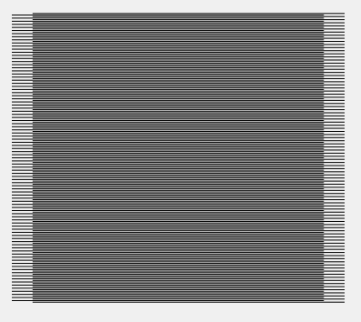
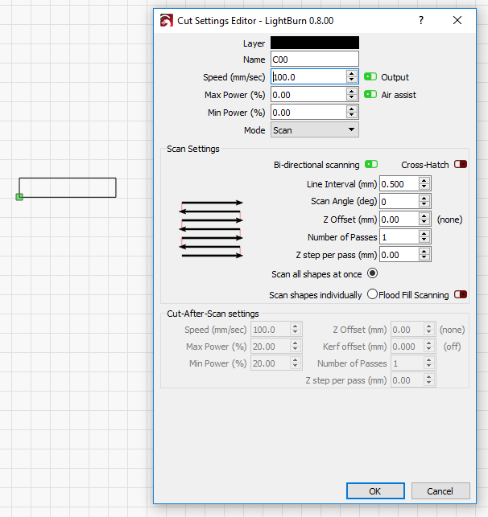
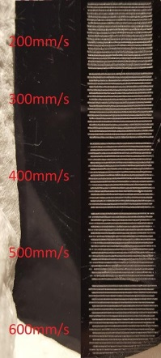
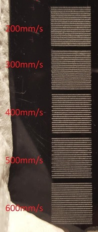
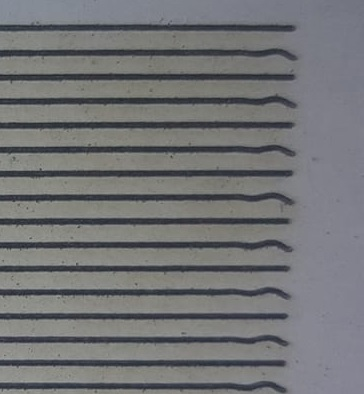

[Return to main page](README.md)

----

# スキャンオフセットの調整

最新のレーザーでは細かく早く動くことが出来るようになりましたが、ビームを出力するにはまだ時間がかかります。中には早いものもありますが、遅いものもまだあります。

100 mm/secondの設定で254 dots/inchだとドットは0.1mmの長さで100mmで1000個になります。100 mm/secでは出力に1 millisecond掛かり、彫刻は1ドット分ズレます。

500 mm/secondでは1 millisecondの遅れが5ドットのズレになり、1/2 millimeterです。そこまで大きくはありませんが、視認出来ます。もっと時間のかかるマシンもあります。

完了後にエッジにゴーストが掛かったように見えることがあります。下記の画像は20mm角で1000 mm/sec出力、1msの遅延の結果で、スキャンに1mmの斜線が発生します:

LightBurnではこれを軽減させるためデバイス設定にスキャンオフセット調整があります。[Device Settings](DeviceSettings.md):

この機能を使うためいくつかの異なるスピードで反応を確認する必要があります。50mm x 10mm の四角形を作り、スキャンにセットしてLine intervalを0.5mmにします。
注意：画像では出力0になっていますが、これは同じ設定にしないでください。

この四角を100mm/sec, 200mm/sec, 300mm/secのようなスピード設定でスキャンしてください。下記がサンプル結果の一つです:

この調整を行うために、それぞれのスピードのズレの距離を測って調整する値を確認します。LightBurnではこのデータを使って他のスピードの調整も行います。最低2つのデータが必要です。

次のリンクでチュートリアルがあるのでご確認ください(英語): http://cartonus.com/how-to-improve-engraving-quality-of-laser-machine/

何回かこの調整を行うことでよりキレイな結果を得ることが出来るようになります。調整後の結果は以下です:

# ラインのゆらぎ

ラインのゆらぎはよくある問題で、早すぎる加速設定で起こることが多い現象です。テストを行うと下記画像のような結果が出ることがあると思います:

この場合、行と行の間で早く動きすぎているためガントリーで跳ねが起きてしまっています。Y軸の加速度を下げることで現象を回避出来ます。

