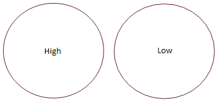
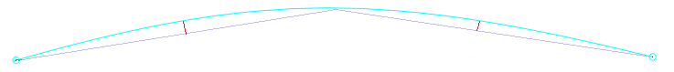

[Return to main page](README.md)

----
# 設定

こちらがメインの設定画面になります

それぞれのセクションで調整を行います:

- [表示/グラフィック](#Display_Graphics)
- [ユニット / グリッド](#Grid_Units)
- [DXF Import Settings](#DXF_Import_Settings)
- [Shape Move Increments](#Shape_Move_Increments)
- [Output Settings](#Output_Settings)
- [Other Setttings](#Other_Settings)

## 表示/グラフィック

この設定はLightBurnの表示にのみ適用されます。実際の出力物には影響がありません。

##### 曲線の精度

LightBurnが出力する曲線の精度を調整します。下記の図を見ると右の画像は直線で円が作られているのが見えます。左も直線で作られているのですが、右よりも多くの直線が使われています。この品質の違いは出力時間に影響がありますが、数千の円を描かない限りはそこまでの差は出ません。

##### アンチエイリアス

"jaggies"として知られるエイリアスは2Dを描いている時にピクセルが見える現象です。アンチエイリアスでは影になるピクセルを出して、出力がよりスムーズになるようにします。下記の図を見ると違いは一目瞭然です。ただし、古いマシンを利用されているユーザーはこの機能を使わない方が濃い部分ではキレイに出力される場合があります。

##### マウスホイールのズーム方向を反転

マウスホイールの設定を反転させます。

##### システムクリップボードを利用

この機能をオンにするとCopy and pasteが少し遅くなりますが、以下の操作が出来るようになります:

- 他のLightBurnやアプリケーションからCopy and pasteが出来るようになる
- 他のソフトウェアやブラウザから画像のコピーが出来る
- テキストを直接ペースト出来る

## ユニット / グリッド

##### Inches / mm

表示値の設定をインチとミリで切り替えます

##### ビジュアルグリッド間隔

グリッドの間隔を調整します。デフォルトは10mm

##### Grid Snap Distance

この値の間隔でラインなどを配置していきます。デフォルトは1mm

##### クリック選択許容値

クリック可能になるまでの距離。値が増えると遠くても選択可能になり、減ると丁寧に選ぶ必要があります。

##### オブジェクトスナップ距離

オブジェクトの点やセンターを選ぶことが出来るようになる距離

##### オブジェクトにスナップ / グリッドにスナップ

オブジェクトにスナップをオンにすると、新しいオブジェクトを作成する時にポインターを近くのオブジェクトの中心や角に持って行ってくれるので、繋がった図形を作りたい時に便利です。グリッドにスナップをオンにするとカーソルを近くのグリッドに移動してくれます。

##### 

## DXF インポート設定

##### Units

DXFファイルはデータ内のサイズの単位を記録していません。データとして5としか入力されていないため、インポート時に5inchで作ったものが5mmでインポートされることもあります。DXFファイルをインポートする時は、ここの値を正しい単位を選択してください。

##### 自動クローズ許容値

DXFファイルでは形状が連続したパスではなく、バラバラのピースとして保存されることがあります。自動クローズ許容値を設定すると同じレイヤにあるラインやカーブでこの値より近いものを繋げるように指示します。

## 形状の移動増分

矢印を使ってオブジェクトを動かす時に、どれだけ動かすのかを設定します。矢印のみ、Ctrl + 矢印、Shift + 矢印での値を設定します。

## 出力設定

この2つの設定は出力物に影響があります。

##### ジョブ原点

ジョブ原点の場所を設定します。詳しくはこちらを御覧ください [Coordinates and Origin](CoordinatesOrigin.md)

##### 曲線許容値

この設定は上記の曲線の精度と同じですが、こちらは実際に出力に影響します。設定した数のまでエラーを許容します。0に設定すると完璧となりますが、かなり重たいデータになります。

上記の画像では2つのポイントを結ぶ曲線を青、直線を黒、エラー(どれだけカーブから離れているか)を赤で記載してあります。このエラーの長さを確認して、設定値よりも低い時は直線を引きます。値が高い時は2つに分けて再度確認をします。下記画像のバイオレットのラインが分かれたラインで新しいエラーがついています。こちらの方がよりオリジナルのカーブに近い出力を実現しています。

大抵の方はこの値をデフォルトの0.05mmから変更する必要はありません。注：この値はエラーの最大値で通常の出力はこれよりも良いものになっています。これはカーブにのみ適用され、直線に点には適用されません。

## その他設定

##### 自動保存の間隔

自動保存の間隔を設定します。

