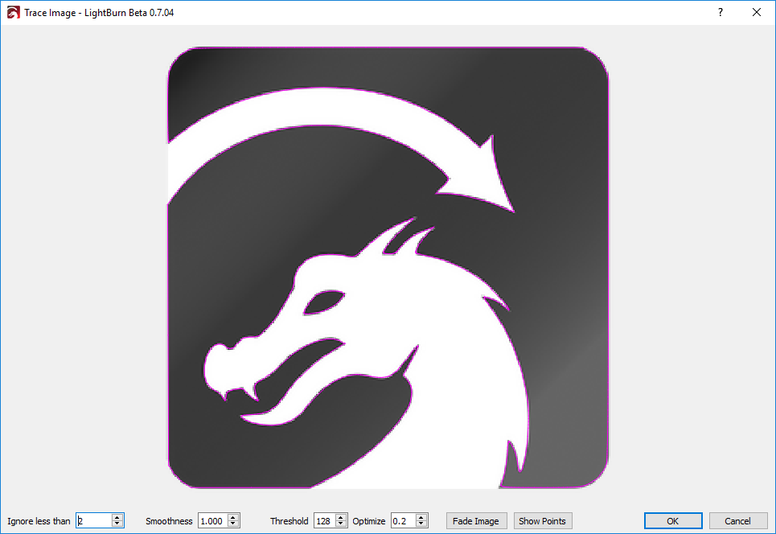

[Return to main page](README.md)

----

# イメージトレーシング

LightBurnにはbitmapの外周をトレースしてvector画像にする機能があります。これはエッジがクリアーなシルエットや漫画などに有効です。写真などにはあまり上手く働きません。

イメージをインポートしてからツール -> イメージをトレースを選びます。(Alt-T)

イメージトレースのウィンドウが開きます。

上記の画像では紫のラインがLightBurnでトレースした跡なります。もっと詳細が見たい場合はイメージをフェードボタンを押すとイメージが薄くなります。プレビュー画像と同じようにズームや動かすことが出来ます。

### コントロール:

##### 指定値未満を無視

Vectorizerにこの値以下のピクセルは無視するように支持します。ノイズの多い画像を読取る時に有効です。

##### 滑らかさ

Bitmapはピクセルで出来ており、ピクセルは四角形です。そのためトレース時になるべくスムーズになるように加工を行います。この数値でどれだけ滑らかにするかを設定します。最大値は1.333で大抵のものを曲線にします。0は全て直線にします。違いは下記画像をご参照ください:

左のイメージは赤い部分で線が見えますが、右では見えません。また青で囲われた部分を見ても違いが分かると思いますが尖っている部分も曲線になっている右側は少しやりすぎかもしれません。デフォルトは1に設定されていて、その設定が大抵の場合最適です。

##### しきい値

しきい値は明るいピクセルと暗いピクセルの間のカットオフとして使用される明るさの値を制御します。連続的な陰影のある画像、または非常に明るいか暗い画像では、最良の結果を得るためにこの値を調整する必要があります。

##### 最適化

線と曲線を生成した後、イメージトレースは類似した線と曲線をマージしてノード数を減らそうとします。 Optimizeパラメータは、これがどれほど積極的かを制御します。 0はマージしないことを意味します。 デフォルトの0.2は、結果の精度とノード数のバランスが良いです。

##### イメージをフェード

イメージを薄くしてvectorシェープを見やすくします。

##### ポイントを表示

vectorトレースで確認したポイントを表示します。