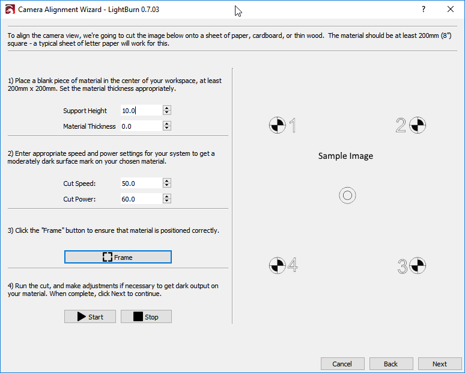

[Return to main page](README.md)

----

# カメラを利用する

LightBurnではカメラを使って以下のことを行えます:

- レーザーをモニターする
- デザインやマテリアルの配置確認
- レーザーベッドで直接トレースをする

モニター利用を行うにはCamera Controlウィンドウを開きます。

下記のような画面が開きます:

利用したカメラをドロップボックスから選択するとカメラ画像が表示されます:

ワイドな画像を撮るためにFish-eyeレンズを利用しているため、画像は歪んでいます。LightBurnでは設定を変えることによって、このような画像でも上から見たような画像に変更することが出来ます。

# カメラキャリブレーション

良い画像を得るためにLightBurnにどのように歪みを取り、どこを撮影すべきなのかを教える必要があります。歪みについてはキャリブレーションを行うことで出来ます。

下記の画像をダウンロードしてプリントする必要があります:

[Calibration-Circles.png](./img/Camera/Calibration-Circles.png)

このサークルイメージは148mm x 105mm (5.8" x 4.1")で少なくとも6mm (1/4") の空白部分が模様の周りにあります。

硬いカードか気に貼り付けてまっ平らボードを作ります。曲がってしまっているとキャリブレーションが上手く行きません。

### カメラキャリブレーションウィザード

パターンをいくつか撮影してキャリブレーションが行われます。ソフトウェアが画像を解析してどれだけ歪んでいるのかを確認します。

**Note:** このプロセスはカメラとレンズ**のみ**が影響しており、カメラとパターンがしっかりと動かない状態であれば、どこに配置したかは関係ありません。もしイメージサイズが合っていない場合は、最適な大きさに縮小/拡大してください。

適度な明かりの元で作業を行ってください。薄暗かったり、影が落ちたりしていると失敗することがあります。

ツールメニューからカメラレンズのキャリブレーションを選んでください。下記のような画面が現れます

カメラを選ぶとその映像が左側に表示されます。正しければ次を押してください

キャプチャーボタンとパターンの置き方を示したヘルプ画像が現れます。最初の撮影ではパターンを真ん中にヘルプ画像のように配置してください。もしサンプル画像のような撮影が出来ない場合は、パターン画像の大きさを調整してください。

キャプチャーボタンを押すとこのような画面が現れます:  (この画像は取り外したカメラの画像になっています)

上記画像の右側に下記が書かれています:

​	Image 1 (1600 x 1200) : Pattern found - Score: 0.09 - Great! Click Next

これの意味は:

- 画像は無事に撮影されました
- 画素数は1600 x 1200 (高い方が良いです)
- キャリブレーションパターンを確認
- よく撮れた画像です - 数値が低い方が良い結果です。この画像では、歪み除去後のドットのエラーの平均値は0.09 ピクセルとなっており、 必要最低値が0.3なのでこれはとても良い数値です

作業を続けていくと歪みが減り、より良い画像を撮影出来るようになります。

キャリブレーションパターンが確認出来ない場合、結果でお伝えします。パターンカードが参考画像のようにカメラに向いていることを確認してください。 

作業を続けていくと、参考画像も更新されます。配置場所が中央から下部、左、右、上部となります。もしfisheyeカメラの効果が強く出ている場合、中央配置時少し中に置くと上手くいくかもしれません。

最後の4枚はコーナー画像です。fisheyeカメラの効果の強いカメラには撮影が難しいかもしれないため、もし最初の5枚のスコアが0.3以下の場合、ここはスキップすることも出来ます。もし最後の4枚の撮影がこんなにも関わらずスキップのオプションが表示されない場合は、どこか分かりやすい場所にパターンを置いて撮影してください。

数回の撮影でも下記のように歪みが消えることもあります:

キャリブレーションが上手くいかないと、歪みが残ったままになります。この場合左下に見えるグレーイメージのグラつき等の他の表示が影響している可能性があります:

もしキレイな画像にならない場合は、再度同じ作業を始めから行ってください。何回か調整して頂くと、最適な手順等も分かってくると思います。

満足行く作業結果が出ましたら、Finishを押して結果を保存してください。"Align Camera"ボタンを最後に押すと次の作業にスムーズに移行できます。

# カメラ調整とワークスペース

カメラのキャリブレーションが終了したら次はカメラの調整です - LightBurnにカメラがワークスペースのどこに設置されているのかを教えます。この作業を行うにあたり、カメラは固定した場所から動かないようにする必要があります。取り外し可能なカメラでもキャリブレーションと利用する位置が全く同じになるのであれば問題ありません。カメラはワークスペースのセンター部分をハッキリとした映像で撮影出来る向きで配置するのが望ましいです。

#### Cutting the Alignment Markers

ツールメニューからカメラの調整キャリブレーションを選択して、レンズのキャリブレーションを行った物を同じカメラを選択します。

カメラ選択後に次に行くと下記のページが現れます:

このページでは画面の右に表示されているデータを彫刻します。

セットしたマテリアルに合った速度と出力をセットします。黒く塗られている部分を黒く出来るがカットはしない程度の出力に設定にしてください。 通常利用していないのであれば、"サポート高さ" と "材料の厚み" は0に設定してください。

正しく設定を行った後彫刻をスタートしてください。もし彫刻が薄すぎたり濃すぎたり等がある場合は、再度調整を行ってやり直してください。作業結果は以下のようになるはずです:

結果が良ければ次を押します

#### ターゲットマークイメージを撮影する

ここでは画面調整のイメージを撮ります。*重要な点として、彫刻後にマーカーイメージを動かさないでください* ジョグやコーナーに動かす等のボタンを押してレーザーヘッドを動かして、カメラの視界から外してください。全てのターゲットがハッキリと見えたら、キャプチャーボタンを押してください。下記画像右側の画像のような歪みのなく4つのターゲットが写っている画像が撮れるはずです:

#### ターゲットのマーキング

全てのターゲットをダブルクリックすることでマーキングを行います。必要に応じてズームやパンを行ってそれぞれのターゲットの真ん中をダブルクリックします。ダブルクリックすると赤い十字が表示されます。書かれている番号の順番で行ってください。もし間違ってクリックした場合はそこの近くをクリックして移動するか、Undoをしてやり直してください。

出来うる限り中心においてください:

全て完了後にズームアウトして、全てハッキリと見えるか確認してください:

次をクリックしてマーキングを完了して、最後にフィニッシュをクリックして作業終了です！

これで全てが調整されました。カメラコントロール画面を開いて"Update Overlay"をクリックして撮影すると、調整が入った画像が撮影されます:

"Fade"で背景を薄くするか"Show"でオン/オフを切り替えてください

